# Crimson Texture Forge

Windows desktop tool for **Crimson Desert texture workflows**, **read-only archive browsing**, **texture research**, and **text search**.

Project changelog: [CHANGELOG.md](CHANGELOG.md)

Crimson Texture Forge is built for modders who want one place to:

- browse and extract files from `.pamt` / `.paz` archives
- scan loose DDS files and rebuild controlled DDS output with `texconv`
- optionally convert DDS to PNG before processing
- optionally upscale through `chaiNNer`, direct `Real-ESRGAN NCNN`, or direct `ONNX Runtime`
- review results in a side-by-side compare view with zoom, pan, and preview-size controls
- inspect texture sets, references, classification, DDS QA results, and notes in `Research`
- search archive or loose text-like files such as `.xml`, `.json`, `.cfg`, and `.lua`

The app is intentionally focused on **read-only archive access** and **loose-file workflows**. It does **not** repack or modify game archives in place.

## At A Glance

### Main tabs

- `Workflow`: loose DDS scanning, optional DDS-to-PNG staging, optional upscaling, DDS rebuild, and compare review
- `Archive Browser`: scan archives, filter entries, preview supported assets, and extract files to normal folders
- `Research`: group related textures, resolve references, inspect DDS QA results, export analysis reports, and store notes
- `Text Search`: search archive or loose text-like files, preview results with syntax colors, and export matched files
- `Settings`: persistent theme, startup, layout, and safety preferences

### Main workflow features

- read-only archive browser for Crimson Desert `.pamt` / `.paz`
- archive cache for faster repeated scans
- DDS-to-PNG conversion with `texconv`
- DDS rebuild with configurable format, size, and mip behavior
- direct backend support for `Real-ESRGAN NCNN` and `ONNX Runtime`
- external `chaiNNer` support for users who already have a working chain
- `Run Summary` dialog for a read-only overview of sources, backend, and texture policy before you start
- `Texture Policy` presets, family-aware suffix classification, planner-aware automatic safety rules, and safer preserve/high-precision handling for technical maps
- optional expert override to force technical maps through the generic PNG/upscale path when you explicitly want unsafe technical processing
- automatic `Source Match` post-correction modes for direct `NCNN` / `ONNX` runs
- optional `NCNN extra args` for advanced direct `Real-ESRGAN NCNN` flags such as `-dn 0.2`
- `Preview Policy` to inspect the planned per-texture action before `Start`
- compare view with shared preview-size presets, per-side zoom, mouse-wheel zoom, drag pan, `Sync Pan`, and focused compare layout
- `Research` tools for shared classifier output, grouped texture sets, sidecar/reference discovery, texture analysis, heatmap views, and local notes
- text search with archive/loose search, regex, local find, wrap toggle, line numbers, and export

## Recommended First Run

If you want the safest starting point, use this path first:

1. Run `CrimsonTextureForge-<version>-windows-portable.exe`.
2. In `Workflow > Setup`, click `Init Workspace`.
3. Configure `texconv.exe` or open its official download page from `Setup`.
4. Set `Original DDS root`, `PNG root`, and `Output root`.
5. In `Workflow > Upscaling`, either:
   - keep the backend disabled if you only want DDS rebuild/testing
   - pick direct `Real-ESRGAN NCNN` or `ONNX Runtime`
   - use `chaiNNer` only if you already have a tested `.chn` chain
6. Keep `Texture Policy` on a safer preset first and leave automatic texture rules enabled.
7. Click `Preview Policy` to inspect what the app plans to do per texture.
8. Click `Scan`.
9. Run a small subset first.
10. Review the results in `Compare` before doing a larger batch.

## Choosing An Upscaling Mode

### Disabled

Use this when you want to:

- rebuild DDS from existing PNG files
- test format/size/mip behavior without any upscaling backend
- stage DDS to PNG only

### Real-ESRGAN NCNN

Use this when you want:

- the simplest in-app direct upscale path
- a portable external executable + local model folder
- direct scale/tile controls in the app
- optional advanced flags through `NCNN extra args`

Setup support in the app includes:

- open the official Real-ESRGAN NCNN download page
- import NCNN `.param` / `.bin` model pairs
- browse a grouped NCNN model catalog for visible color/albedo/UI texture use cases and open non-downloading model pages in your browser

### ONNX Runtime

Use this when you want:

- direct in-app inference with local `.onnx` models
- provider selection handled by ONNX Runtime
- direct scale/tile/post-correction controls without an external chain

Setup support in the app includes:

- open the official ONNX Runtime install guide
- import `.onnx` model files into the configured model folder

### chaiNNer

Use this when you already have:

- a tested `.chn` chain
- the node/back-end dependencies installed separately
- a known-good input/output path setup

Important:

- `chaiNNer` remains the source of truth for its own chain behavior
- direct NCNN / ONNX controls in Crimson Texture Forge do **not** override the chain

## Texture Policy And Safety

`Texture Policy` is the safety gate that decides which files are allowed into the PNG/upscale path.

What it does:

- classifies textures into kinds such as `color`, `normal`, `mask`, `height`, `ui`, `emissive`, and `unknown`
- applies presets that decide which kinds are safe to process
- uses automatic rules to preserve higher-risk technical DDS files instead of blindly rebuilding them from generic PNG output
- can route eligible non-packed scalar technical DDS files through a safer high-precision path instead of the normal visible-color PNG path
- can optionally force technical maps through the generic visible-color PNG/upscale path with an explicit expert override, but this is intentionally marked unsafe
- can use more than file names alone, including texture-family context and preview-derived hints
- recognizes common explicit names and suffix families such as `_color`, `_normal`, `_subsurface`, `_dmap`, `_n`, `_wn`, `_sp`, `_m`, `_ma`, `_mg`, `_o`, `_disp`, `_dr`, `_op`, `_emc`, and `_emi`
- treats ambiguous names like `_d` more cautiously instead of assuming they are always safe color/diffuse textures

What to keep in mind:

- presets control **what gets sent to the upscaler**
- the expert unsafe technical override can still force preserved technical maps onto the generic visible-color path if you explicitly enable it
- presets do **not** guarantee visual correctness
- model choice can still shift brightness, contrast, detail, or color range

For a first run:

- start with a safer preset
- keep automatic rules enabled
- use `Preview Policy`
- review a small batch in `Compare`

## Post Correction

Direct `Real-ESRGAN NCNN` and direct `ONNX Runtime` support optional post-upscale correction modes:

- `match_mean_luma`
- `match_levels`
- `match_histogram`
- `Source Match Balanced`
- `Source Match Extended`
- `Source Match Experimental`

`Source Match` modes are the recommended option for most direct-backend runs. They automatically decide per texture whether to:

- apply visible RGB correction
- apply grayscale/scalar-only correction
- limit correction to RGB while leaving alpha untouched
- skip correction entirely when the texture looks technical or unsafe

The older `match_*` modes are still available as simpler visible-texture correction tools.

These correction paths are intended mainly for visible textures such as:

- `color`
- `ui`
- `emissive`
- `impostor`

They are not meant as a blanket fix for all texture types, and they do not apply to `chaiNNer`.

## Compare And Review

`Compare` is now one of the main review tools in the app.

You can:

- compare original and rebuilt DDS previews side by side
- switch preview size for both panes together
- zoom each side separately
- zoom with the mouse wheel while hovering a preview
- drag to pan large previews
- use `Sync Pan` to keep both panes aligned
- move through files with `Previous` / `Next`
- jump straight to matching mip analysis with `Mip Details`
- open the output folder directly

When `Compare` is active, the workflow layout gives more space to the preview area so review is easier.

Use `Compare` after every small test run before committing to a larger batch, especially when:

- trying a new model
- changing scale or tile behavior
- changing texture presets
- testing post-correction modes

## Research

`Research` is the in-app support area for understanding texture sets and validating output.

It uses the same family-aware texture semantics as the workflow planner and the newer archive role filters, so grouped sets, analysis, and safety decisions line up more consistently.

### Archive Insights

Includes tools for:

- texture set grouping
- texture-type classifier output
- material-to-texture reference resolution
- archive-side sidecar discovery
- texture usage heatmap views
- extracting related sets

### Texture Analysis

Includes tools for:

- matching Original DDS vs Output DDS review
- mip and size drift checks
- preview-based brightness, alpha, and range checks when `texconv` previews are available
- bulk normal validation
- CSV / JSON report export

### Notes

Lets you attach local notes and tags to:

- archive files
- text-search results
- compare targets

Notes are stored locally beside the EXE.

## Archive Browser

The archive browser is read-only. Use it to:

- scan or refresh `.pamt` / `.paz`
- reuse the archive cache when available
- filter by path, package, extension, role, structure, and size
- use exclude filters and common technical-suffix hiding to isolate likely base/color DDS files more quickly
- preview supported assets
- extract selected files or filtered sets to normal folders
- send DDS files directly into the workflow with `DDS To Workflow`

The app does **not** repack archives.

## Text Search

`Text Search` is a supporting utility for archive and loose text-like files.

It supports:

- archive or loose-folder search
- plain text or regex search
- path filtering
- syntax-colored preview
- line numbers
- local find-in-preview controls
- wrap toggle
- font-size controls
- export of matched files while preserving folder structure

For supported encrypted archive XML cases, the app can also decrypt them deterministically so they can be searched and previewed as readable text.

## DDS Output

Final DDS output is rebuilt with `texconv`.

You can control:

- format: match original or choose a custom format
- size: use final PNG size, original DDS size, or a custom size
- mipmaps: match original, generate full chain, single mip, or custom count

The DDS output section now also explains the difference between:

- source PNG staging
- final PNG output
- rebuilt DDS output

When automatic safety rules are enabled, the planner can also keep some technical DDS files unchanged or route eligible scalar technical files through a safer high-precision rebuild path instead of treating everything like a normal visible-color PNG workflow.

## Troubleshooting

### Missing texconv

If `texconv.exe` is missing or wrong:

- DDS preview fails
- DDS-to-PNG conversion fails
- DDS rebuild fails
- compare preview generation fails

### Missing NCNN / ONNX setup

For direct backends, make sure you have:

- a working NCNN executable plus matching `.param` / `.bin` models
- or a working ONNX Runtime installation plus compatible `.onnx` models

### chaiNNer produced no usable output

If `chaiNNer` finishes but the app cannot rebuild DDS:

- check that the chain writes outputs where you expect
- make sure the chain writes to the correct PNG folder
- confirm the chain is reading the correct input type and path

### Brightness or tonal drift

If rebuilt color textures look darker, flatter, or otherwise shifted:

- verify the texture was safe to upscale
- compare it in `Compare`
- try a safer preset
- try a different model
- try `Source Match Balanced` first on direct `NCNN` / `ONNX`
- test `match_levels` or `match_histogram` if you want a simpler visible-texture-only correction path
- remember that automatic texture safety rules are mainly about safer format/preserve policy, not about fixing tonal drift by themselves

### Too many files are `unknown`

Classification is improved, but not perfect. If needed:

- use safer presets
- keep automatic rules enabled
- inspect grouped families in `Research`
- look at nearby material/sidecar files in `Research` or `Text Search`
- use `Archive Browser` role and exclude filters to narrow to likely base/color textures while reviewing suffix families

## Local State

The app stores its portable local state beside the EXE.

Main local files and folders include:

- `CrimsonTextureForge.cfg`
- `archive_cache`
- research notes / related local support files

The app also supports:

- profile export / import
- diagnostic bundle export

## Privacy And Network Behavior

Crimson Texture Forge does **not** include built-in telemetry, analytics, auto-update checks, background network calls for normal offline use, or in-app file downloads for external tools/models.

It only opens external pages in your browser when you explicitly trigger actions such as:

- `Open chaiNNer Download Page`
- `Open texconv Download Page`
- `Open Real-ESRGAN NCNN Download Page`
- `ONNX Runtime Guide`
- `Open Model Pages` in the NCNN model catalog

## Screenshots

### Archive Browser

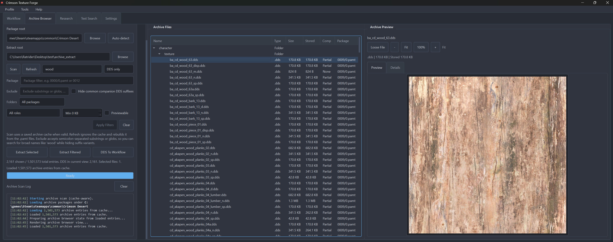

### Workflow: DDS To PNG / DDS Rebuild

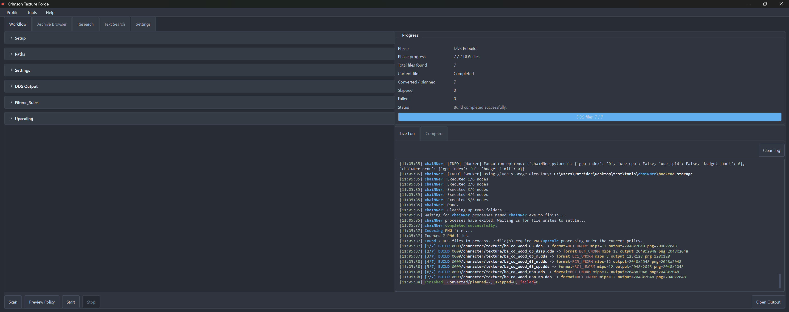

### Workflow: Upscaling Running

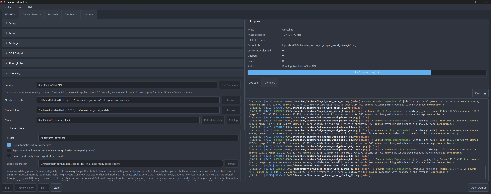

### Workflow: NCNN Model Catalog

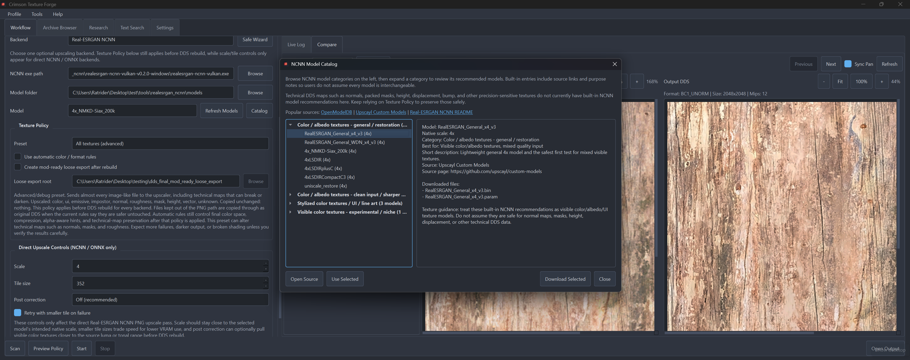

### Compare View

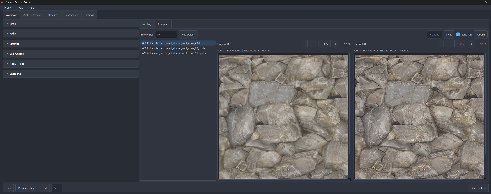

### Compare View: Alternate Example

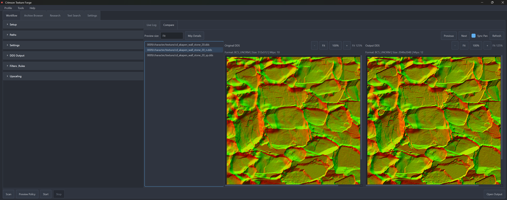

### Compare View: Alternate Example

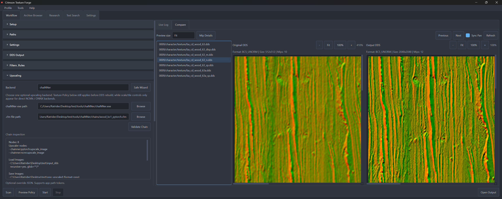

### Compare View: Alternate Example

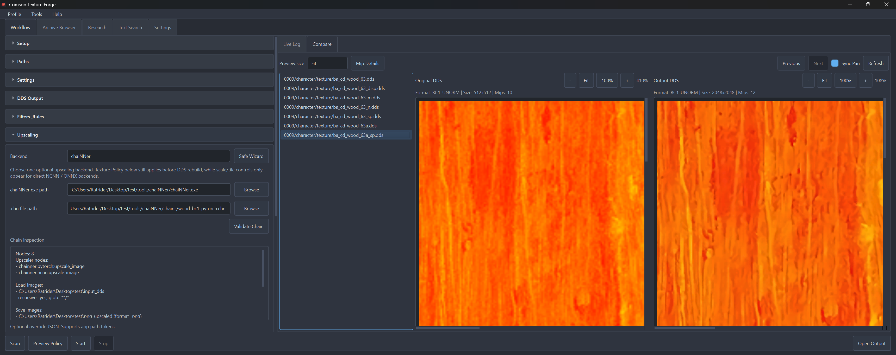

### Compare View: Alternate Example

### Research: Archive Insights

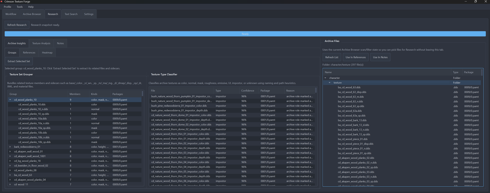

### Research: References

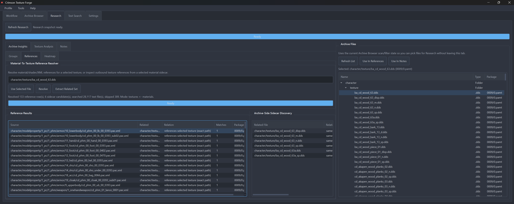

### Research: Texture Analysis

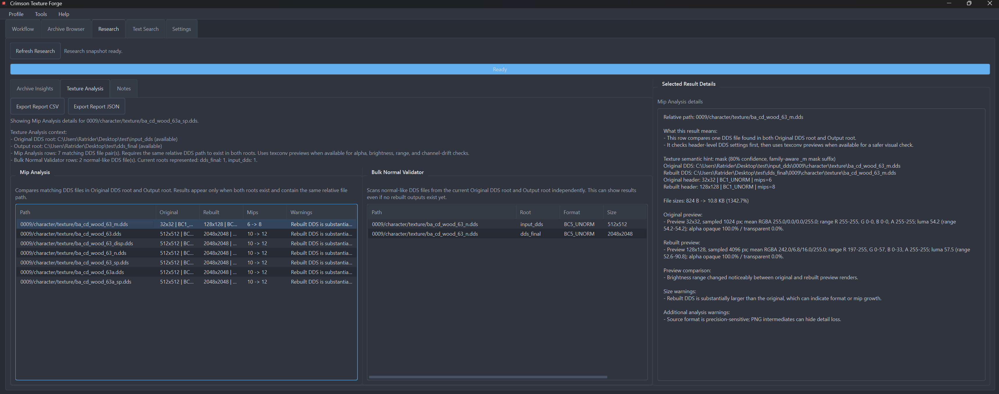

### Text Search

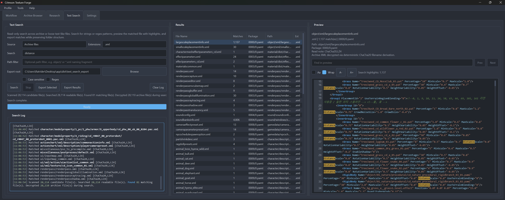

## Dependencies

### Python packages used by the app

- `PySide6`
- `PyInstaller`
- `lz4`
- `cryptography`

Build requirements are listed in `requirements-build.txt`.

### External tools used by the app

- `texconv.exe` from Microsoft DirectXTex
- optional `chaiNNer`
- optional `Real-ESRGAN NCNN`
- optional ONNX Runtime packages / models
